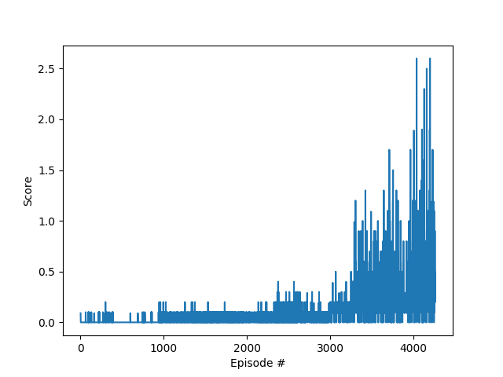

[//]: # (Image References)

[image1]: https://user-images.githubusercontent.com/10624937/42135623-e770e354-7d12-11e8-998d-29fc74429ca2.gif "Trained Agent"
[image2]: https://user-images.githubusercontent.com/10624937/42135622-e55fb586-7d12-11e8-8a54-3c31da15a90a.gif "Soccer"

# Project 3: Collaboration and Competition

## Introduction

In this environment, two agents control rackets to bounce a ball over a net. If an agent hits the ball over the net, it receives a reward of +0.1. If an agent lets a ball hit the ground or hits the ball out of bounds, it receives a reward of -0.01. Thus, the goal of each agent is to keep the ball in play.

The observation space consists of 8 variables corresponding to the position and velocity of the ball and racket. Each agent receives its own, local observation. Two continuous actions are available, corresponding to movement toward (or away from) the net, and jumping.

The task is episodic, and in order to solve the environment, your agents must get an average score of +0.5 (over 100 consecutive episodes, after taking the maximum over both agents). Specifically,

    - After each episode, we add up the rewards that each agent received (without discounting), to get a score for each agent. This yields 2 (potentially different) scores. We then take the maximum of these 2 scores.
    - This yields a single score for each episode.

The environment is considered solved, when the average (over 100 episodes) of those scores is at least +0.5.

For this project, you will work with the [Tennis](https://github.com/Unity-Technologies/ml-agents/blob/master/docs/Learning-Environment-Examples.md#tennis) environment.

![Trained Agent][image1]

In this environment, two agents control rackets to bounce a ball over a net. If an agent hits the ball over the net, it receives a reward of +0.1.  If an agent lets a ball hit the ground or hits the ball out of bounds, it receives a reward of -0.01.  Thus, the goal of each agent is to keep the ball in play.

The observation space consists of 8 variables corresponding to the position and velocity of the ball and racket. Each agent receives its own, local observation.  Two continuous actions are available, corresponding to movement toward (or away from) the net, and jumping. 

The task is episodic, and in order to solve the environment, your agents must get an average score of +0.5 (over 100 consecutive episodes, after taking the maximum over both agents). Specifically,

- After each episode, we add up the rewards that each agent received (without discounting), to get a score for each agent. This yields 2 (potentially different) scores. We then take the maximum of these 2 scores.
- This yields a single **score** for each episode.

The environment is considered solved, when the average (over 100 episodes) of those **scores** is at least +0.5.

### Getting Started

1. Download the environment from one of the links below.  You need only select the environment that matches your operating system:
    - Linux: [click here](https://s3-us-west-1.amazonaws.com/udacity-drlnd/P3/Tennis/Tennis_Linux.zip)
    - Mac OSX: [click here](https://s3-us-west-1.amazonaws.com/udacity-drlnd/P3/Tennis/Tennis.app.zip)
    - Windows (32-bit): [click here](https://s3-us-west-1.amazonaws.com/udacity-drlnd/P3/Tennis/Tennis_Windows_x86.zip)
    - Windows (64-bit): [click here](https://s3-us-west-1.amazonaws.com/udacity-drlnd/P3/Tennis/Tennis_Windows_x86_64.zip)
    
    (_For Windows users_) Check out [this link](https://support.microsoft.com/en-us/help/827218/how-to-determine-whether-a-computer-is-running-a-32-bit-version-or-64) if you need help with determining if your computer is running a 32-bit version or 64-bit version of the Windows operating system.

    (_For AWS_) If you'd like to train the agent on AWS (and have not [enabled a virtual screen](https://github.com/Unity-Technologies/ml-agents/blob/master/docs/Training-on-Amazon-Web-Service.md)), then please use [this link](https://s3-us-west-1.amazonaws.com/udacity-drlnd/P3/Tennis/Tennis_Linux_NoVis.zip) to obtain the "headless" version of the environment.  You will **not** be able to watch the agent without enabling a virtual screen, but you will be able to train the agent.  (_To watch the agent, you should follow the instructions to [enable a virtual screen](https://github.com/Unity-Technologies/ml-agents/blob/master/docs/Training-on-Amazon-Web-Service.md), and then download the environment for the **Linux** operating system above._)

2. Place the file in the DRLND GitHub repository, in the `p3_collab-compet/` folder, and unzip (or decompress) the file. 

## Instructions

Follow the instructions in `Tennis.ipynb` to get started with training your own agent!  

## (Optional) Challenge: Crawler Environment

After you have successfully completed the project, you might like to solve the more difficult **Soccer** environment.

![Soccer][image2]

In this environment, the goal is to train a team of agents to play soccer.  

You can read more about this environment in the ML-Agents GitHub [here](https://github.com/Unity-Technologies/ml-agents/blob/master/docs/Learning-Environment-Examples.md#soccer-twos).  To solve this harder task, you'll need to download a new Unity environment.  (**Note**: Udacity students should not submit a project with this new environment.)

You need only select the environment that matches your operating system:
- Linux: [click here](https://s3-us-west-1.amazonaws.com/udacity-drlnd/P3/Soccer/Soccer_Linux.zip)
- Mac OSX: [click here](https://s3-us-west-1.amazonaws.com/udacity-drlnd/P3/Soccer/Soccer.app.zip)
- Windows (32-bit): [click here](https://s3-us-west-1.amazonaws.com/udacity-drlnd/P3/Soccer/Soccer_Windows_x86.zip)
- Windows (64-bit): [click here](https://s3-us-west-1.amazonaws.com/udacity-drlnd/P3/Soccer/Soccer_Windows_x86_64.zip)

Then, place the file in the `p3_collab-compet/` folder in the DRLND GitHub repository, and unzip (or decompress) the file.  Next, open `Soccer.ipynb` and follow the instructions to learn how to use the Python API to control the agent.

(_For AWS_) If you'd like to train the agents on AWS (and have not [enabled a virtual screen](https://github.com/Unity-Technologies/ml-agents/blob/master/docs/Training-on-Amazon-Web-Service.md)), then please use [this link](https://s3-us-west-1.amazonaws.com/udacity-drlnd/P3/Soccer/Soccer_Linux_NoVis.zip) to obtain the "headless" version of the environment.  You will **not** be able to watch the agents without enabling a virtual screen, but you will be able to train the agents.  (_To watch the agents, you should follow the instructions to [enable a virtual screen](https://github.com/Unity-Technologies/ml-agents/blob/master/docs/Training-on-Amazon-Web-Service.md), and then download the environment for the **Linux** operating system above._)


# Solved

```Bash

(drlnd) lunarpulse@lunarpulse-XPS-15-9550:~/Documents/DRLND/p3/p3_collab-compet$ cd /home/lunarpulse/Documents/DRLND/p3/p3_collab-compet ; env PYTHONIOENCODING=UTF-8 PYTHONUNBUFFERED=1 /home/lunarpulse/miniconda3/envs/drlnd/bin/python /home/lunarpulse/.vscode/extensions/ms-python.python-2019.11.50794/pythonFiles/ptvsd_launcher.py --default --client --host localhost --port 43263 /home/lunarpulse/Documents/DRLND/p3/p3_collab-compet/train_tennis.py 
Found path: /home/lunarpulse/Documents/DRLND/p3/p3_collab-compet/./Tennis_Linux/Tennis.x86_64
Mono path[0] = '/home/lunarpulse/Documents/DRLND/p3/p3_collab-compet/./Tennis_Linux/Tennis_Data/Managed'
Mono config path = '/home/lunarpulse/Documents/DRLND/p3/p3_collab-compet/./Tennis_Linux/Tennis_Data/MonoBleedingEdge/etc'
Preloaded 'ScreenSelector.so'
Preloaded 'libgrpc_csharp_ext.x64.so'
Unable to preload the following plugins:
        ScreenSelector.so
        libgrpc_csharp_ext.x86.so
Logging to /home/lunarpulse/.config/unity3d/Unity Technologies/Unity Environment/Player.log
INFO:unityagents:
'Academy' started successfully!
Unity Academy name: Academy
        Number of Brains: 1
        Number of External Brains : 1
        Lesson number : 0
        Reset Parameters :

Unity brain name: TennisBrain
        Number of Visual Observations (per agent): 0
        Vector Observation space type: continuous
        Vector Observation space size (per agent): 8
        Number of stacked Vector Observation: 3
        Vector Action space type: continuous
        Vector Action space size (per agent): 2
        Vector Action descriptions: , 
Number of agents: 2
Size of each action: 2
There are 2 agents. Each observes a state with length: 24
The state for the first agent looks like: [ 0.          0.          0.          0.          0.          0.
  0.          0.          0.          0.          0.          0.
  0.          0.          0.          0.         -6.65278625 -1.5
 -0.          0.          6.83172083  6.         -0.          0.        ]
Episode 50      Average Score: 0.0018
Episode 100     Average Score: 0.0039
Episode 150     Average Score: 0.0050
Episode 200     Average Score: 0.0029
Episode 250     Average Score: 0.0049
Episode 300     Average Score: 0.0079
Episode 350     Average Score: 0.0079
Episode 400     Average Score: 0.0079
Episode 450     Average Score: 0.0039
Episode 500     Average Score: 0.0000
Episode 550     Average Score: 0.0000
Episode 600     Average Score: 0.0018
Episode 650     Average Score: 0.0018
Episode 700     Average Score: 0.0009
Episode 750     Average Score: 0.0037
Episode 800     Average Score: 0.0084
Episode 850     Average Score: 0.0066
Episode 900     Average Score: 0.0040
Episode 950     Average Score: 0.0100
Episode 1000    Average Score: 0.0388
Episode 1050    Average Score: 0.0533
Episode 1100    Average Score: 0.0294
Episode 1150    Average Score: 0.0138
Episode 1200    Average Score: 0.0147
Episode 1250    Average Score: 0.0217
Episode 1300    Average Score: 0.0219
Episode 1350    Average Score: 0.0300
Episode 1400    Average Score: 0.0488
Episode 1450    Average Score: 0.0475
Episode 1500    Average Score: 0.0389
Episode 1550    Average Score: 0.0465
Episode 1600    Average Score: 0.0482
Episode 1650    Average Score: 0.0525
Episode 1700    Average Score: 0.0652
Episode 1750    Average Score: 0.0629
Episode 1800    Average Score: 0.0548
Episode 1850    Average Score: 0.0482
Episode 1900    Average Score: 0.0431
Episode 1950    Average Score: 0.0412
Episode 2000    Average Score: 0.0317
Episode 2050    Average Score: 0.0179
Episode 2100    Average Score: 0.0120
Episode 2150    Average Score: 0.0120
Episode 2200    Average Score: 0.0310
Episode 2250    Average Score: 0.0420
Episode 2300    Average Score: 0.0320
Episode 2350    Average Score: 0.0320
Episode 2400    Average Score: 0.0460
Episode 2450    Average Score: 0.0560
Episode 2500    Average Score: 0.0620
Episode 2550    Average Score: 0.0618
Episode 2600    Average Score: 0.0666
Episode 2650    Average Score: 0.0913
Episode 2700    Average Score: 0.0889
Episode 2750    Average Score: 0.0855
Episode 2800    Average Score: 0.0910
Episode 2850    Average Score: 0.0725
Episode 2900    Average Score: 0.0682
Episode 2950    Average Score: 0.0645
Episode 3000    Average Score: 0.0630
Episode 3050    Average Score: 0.0890
Episode 3100    Average Score: 0.1125
Episode 3150    Average Score: 0.1155
Episode 3200    Average Score: 0.1174
Episode 3250    Average Score: 0.1187
Episode 3300    Average Score: 0.1463
Episode 3350    Average Score: 0.2129
Episode 3400    Average Score: 0.2380
Episode 3450    Average Score: 0.2402
Episode 3500    Average Score: 0.2338
Episode 3550    Average Score: 0.2457
Episode 3600    Average Score: 0.2615
Episode 3650    Average Score: 0.2878
Episode 3700    Average Score: 0.2957
Episode 3750    Average Score: 0.3191
Episode 3800    Average Score: 0.3672
Episode 3850    Average Score: 0.3122
Episode 3900    Average Score: 0.2150
Episode 3950    Average Score: 0.1875
Episode 4000    Average Score: 0.3018
Episode 4050    Average Score: 0.4133
Episode 4100    Average Score: 0.4253
Episode 4150    Average Score: 0.4085
Episode 4200    Average Score: 0.4854
Episode 4250    Average Score: 0.4981

Problem Solved!

Total time elapsed: 10882.696905374527 seconds
```
Slower than the MADDPG . more stable than the mint one.

